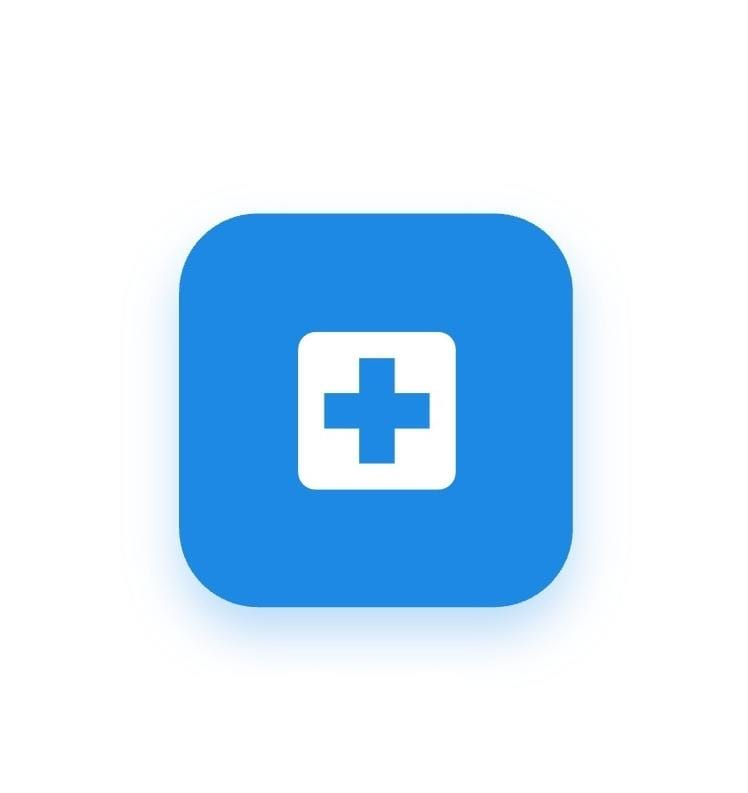

<div align="center">



# 🏥 Online Hospital System

### *Your health, one tap away — book, consult, and pay from anywhere.*

[](https://flutter.dev)
[](https://dart.dev)
[](https://firebase.google.com)
[](https://stripe.com)
[](https://twilio.com)
[](https://flutter.dev)

</div>

---

## 📖 About

**Online Hospital System** is a full-featured Flutter mobile application that digitizes the healthcare experience. Patients can browse medical services, book doctor consultations, select time slots, pay securely, and communicate with doctors — all from their smartphones.

Built as a graduation project at **Sadat Academy for Management and Sciences**, the app covers 13 screens with a clean, card-based UI featuring a blue gradient design (`#E3F2FD → #FFFFFF`), Poppins font, and 300ms scale animations.

---

## 🚀 Key Features

- 🔐 **Secure Authentication** — Firebase Auth with email/password registration, login, and session management
- 🏥 **Medical Service Browsing** — Browse doctors, radiology, lab tests, room reservations, and surgeries with search & filter
- 📅 **Appointment Booking** — Select service, pick a time slot, and confirm booking in a few taps
- 💳 **Secure Online Payments** — Stripe-powered payment gateway supporting saved cards and manual input (PCI-DSS compliant)
- 💬 **Real-Time Chat** — Text, voice, and video calls between patients and doctors/support staff via Twilio API
- 🔔 **Push Notifications** — Booking confirmations, appointment reminders, and payment updates via Firebase Cloud Messaging
- 📋 **Booking Management** — View active and past bookings, cancel appointments with real-time status updates
- 💰 **Payment History** — Track all past transactions from a dedicated Payments screen
- 👤 **Profile Management** — Edit personal info, manage payment methods, and view history
- 🎨 **Premium UI/UX** — Gradient background, Poppins font, Scale animations (300ms), card-based layouts
- 📱 **Responsive Design** — Compatible with Android 8.0+ and iOS 12.0+
- ✨ **Staggered Animations** — Smooth entrance effects using `flutter_staggered_animations`

---

## 🛠️ Tech Stack

| Layer | Technology |
|---|---|
| **Framework** | Flutter 3.x / Dart 3.7.0 |
| **Authentication** | Firebase Auth (email/password, Google Sign-In, Apple Sign-In, Facebook Auth) |
| **Database** | Cloud Firestore (real-time NoSQL) |
| **Backend Logic** | Firebase Cloud Functions |
| **Push Notifications** | Firebase Cloud Messaging (FCM) |
| **Payments** | Stripe API (PCI-DSS compliant) |
| **Voice & Video Calls** | Twilio API |
| **Networking** | HTTP package |
| **Local Storage** | Shared Preferences |
| **Animations** | Flutter Staggered Animations |
| **Localization** | Intl |
| **Design Tool** | Figma (UI/UX Prototyping) |
| **Version Control** | Git & GitHub |
| **App Icon** | Flutter Launcher Icons |

---

## 🏗️ Project Structure

```
online_hospital/
├── lib/
│   ├── core/                      # App-wide utilities, constants & theme
│   │   ├── theme/                 # Colors (#1976D2 accent), text styles, Poppins font
│   │   └── utils/                 # Helpers, validators, date formatters
│   ├── data/                      # Data layer
│   │   ├── models/                # Patient, Doctor, Room, Booking, Payment models
│   │   └── repositories/          # Firestore & API repository pattern
│   ├── screens/                   # 13 feature screens
│   │   ├── splash/                # Logo / Splash screen
│   │   ├── onboarding/            # Onboarding flow
│   │   ├── auth/                  # Sign Up & Login screens
│   │   ├── services/              # Services browsing & filtering
│   │   ├── time_selection/        # Appointment time slot picker
│   │   ├── payment/               # Stripe payment screen
│   │   ├── confirmation/          # Booking confirmation screen
│   │   ├── bookings/              # Active & past bookings management
│   │   ├── payments_history/      # Payment history screen
│   │   ├── notifications/         # FCM notification center
│   │   ├── chat/                  # Twilio text/voice/video chat
│   │   └── profile/               # User profile & settings
│   ├── widgets/                   # Reusable UI components
│   │   ├── service_card.dart      # Animated service card (Scale 300ms)
│   │   ├── doctor_card.dart       # Doctor listing card
│   │   └── bottom_nav_bar.dart    # Main navigation bar
│   └── main.dart                  # App entry point & Firebase initialization
├── assets/
│   ├── icons/                     # App icons
│   ├── doctor3.jpg                # Doctor images
│   ├── doctor4.jpg
│   ├── mri.jpg                    # Service images
│   ├── ct.jpg
│   ├── blood_test.jpg
│   ├── thyroid.jpg
│   ├── private_room.jpg
│   └── surgery.jpg
├── pubspec.yaml
└── README.md
```

> 📌 The project follows a **feature-first layered architecture**, separating data models, repositories, and UI screens for clean, scalable, and maintainable code.

---

## 📱 App Screens (13 Screens)

| # | Screen | Description |
|---|---|---|
| 1 | 🖼️ Splash / Logo | App launch screen |
| 2 | 📋 Onboarding | App introduction slides |
| 3 | 📝 Sign Up | Registration with 5 fields + social auth |
| 4 | 🔐 Login | Email/password + Google/Apple/Facebook |
| 5 | 🏥 Services | Browse doctors, radiology, lab tests, rooms, surgeries |
| 6 | 🕐 Time Selection | Pick available date & time slot |
| 7 | 💳 Payment | Stripe secure payment |
| 8 | ✅ Confirmation | Booking confirmation details |
| 9 | 📋 Bookings | View & cancel active/past bookings |
| 10 | 💰 Payments History | Transaction history |
| 11 | 🔔 Notifications | FCM alerts & reminders |
| 12 | 💬 Chat | Text, voice & video with doctors |
| 13 | 👤 Profile | Personal info & settings |

---

## ⚙️ Getting Started

### Prerequisites

- Flutter SDK `^3.7.0` — [Install Flutter](https://docs.flutter.dev/get-started/install)
- Dart SDK `^3.7.0`
- Android Studio / Xcode
- Firebase project with Auth, Firestore, Cloud Functions & FCM enabled
- Stripe account with publishable key
- Twilio account for voice/video features

### Installation

```bash
# 1. Clone the repository
git clone https://github.com/your-username/online-hospital.git
cd online_hospital

# 2. Install dependencies
flutter pub get

# 3. Configure Firebase
# - Place google-services.json in android/app/
# - Place GoogleService-Info.plist in ios/Runner/

# 4. Add API Keys
# - Add your Stripe publishable key in the payment configuration
# - Add your Twilio credentials in the chat configuration

# 5. Generate app icons
dart run flutter_launcher_icons

# 6. Run the app
flutter run
```

### Environment Configuration

```
android/app/google-services.json         ← Firebase Android config
ios/Runner/GoogleService-Info.plist      ← Firebase iOS config
```

---

## 🗃️ Database Design (ERD Summary)

| Entity | Key Attributes |
|---|---|
| **Patient** | userID (PK), fullName, username, email, password, phone |
| **Booking** | bookingID (PK), userID (FK), doctorID (FK), roomID (FK), date, time, status, amount |
| **Doctor** | doctorID (PK), name, specialty, location, price, availability |
| **Room** | roomID (PK), name, description, location, price, availability |
| **Payment** | paymentID (PK), userID (FK), bookingID (FK), amount, date, method |

---

## 🎓 Academic Context

> **Graduation Project** — Sadat Academy for Management and Sciences, Faculty of Management Sciences, Major: BIS
>
> **Supervisor:** Dr. Lamia Al Adel
>
> **Team:** Takei Ahmed Suleiman · Mohamed Hassan Mohamed Ali · Adham Ahmed Hassan El Sayed

---

## 🔮 Future Roadmap

- 🤖 **AI Health Recommendations** — ML-based doctor & service suggestions
- 🩺 **AI Diagnostic Chatbot** — Symptom checker before doctor consultation
- 🌍 **Multi-Language Support** — Arabic, French, and more
- 👨⚕️ **Doctor & Admin Dashboard** — Manage schedules and resources
- 📴 **Offline Mode** — Access bookings without internet
- ⌚ **Wearable Integration** — Sync health metrics from smartwatches
- 💊 **Pharmacy Integration** — Medicine ordering and delivery

---

<div align="center">
  <sub>Built with 💙 using Flutter · Powered by Firebase & Stripe · Designed in Figma</sub><br/>
  <sub>⭐ Star this repo if you found it helpful!</sub>
</div>
